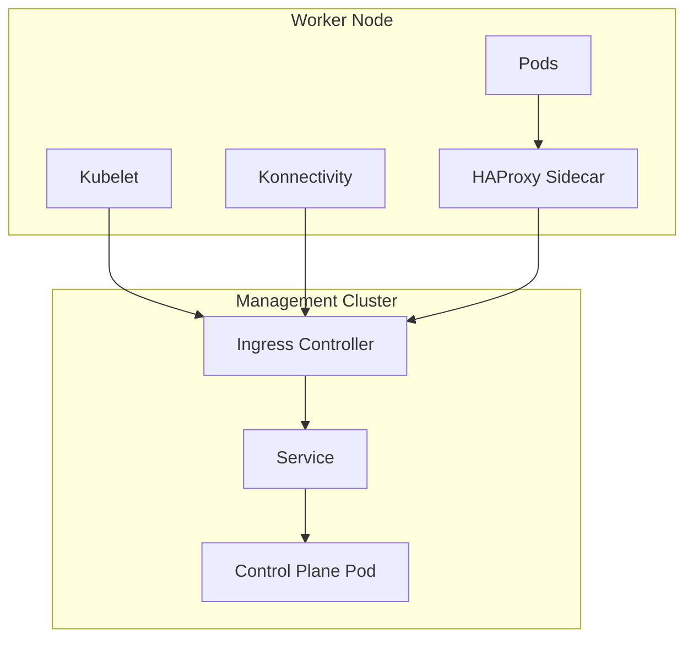

# Ingress Support for Hosted Control Planes

k0smotron now supports exposing kube-apiserver and konnectivity server through ingress controllers for HCPs, enabling access to your clusters via hostnames instead of direct service endpoints. This feature works with both standalone k0smotron clusters and Cluster API managed clusters.

!!! warning "Important Note"
    This feature requires an ingress controller that supports SSL passthrough (e.g., HAProxy, NGINX, Traefik). Ensure your ingress controller is properly configured to handle TLS traffic.

## Overview

k0smotron will create an ingress resource that routes traffic to the control plane service. Each worker node runs a local 
HAProxy sidecar that proxies traffic from pods to the ingress controller. The kubelet connects directly to the ingress 
controller for control plane communication, while pods communicate through the HAProxy sidecar.

## Architecture

The ingress support works by:

1. **Ingress Resource Creation**: k0smotron creates a Kubernetes Ingress resource that routes traffic to the control plane service
2. **HAProxy Sidecar**: A local HAProxy instance runs as a sidecar in each worker node to proxy traffic from pods to the ingress controller
3. **Service Configuration**: The kubernetes default service is configured to point to the HAProxy sidecar for pod-to-API communication
4. **Direct Kubelet Access**: Kubelet connects directly to the ingress controller for control plane communication
5. **SSL Passthrough**: The ingress controller uses SSL passthrough to maintain end-to-end encryption



## Usage Examples

### Cluster API Integration

```yaml
apiVersion: controlplane.cluster.x-k8s.io/v1beta1
kind: K0smotronControlPlane
metadata:
  name: my-cluster-cp
  namespace: default
spec:
  version: v1.34.0-k0s.0
  ingress:
    apiHost: kube-api.example.com
    konnectivityHost: konnectivity.example.com
    className: haproxy
    annotations:
      haproxy.org/ssl-passthrough: "true"
```

### Standalone k0smotron Cluster

!!! danger "Warning"
    When using standalone k0smotron clusters with ingress support, you need to manually set up and configure the HAProxy sidecar on each worker node. See the [Manual Worker Setup for Standalone Clusters](#manual-worker-setup-for-standalone-clusters) section below.

```yaml
apiVersion: k0smotron.io/v1beta1
kind: Cluster
metadata:
  name: my-cluster
  namespace: default
spec:
  version: v1.34.0-k0s.0
  ingress:
    apiHost: kube-api.example.com
    konnectivityHost: konnectivity.example.com
    className: haproxy
    annotations:
      haproxy.org/ssl-passthrough: "true"
```

## Manual Worker Setup for Standalone Clusters

When using standalone k0smotron clusters with ingress support, you need to manually set up the HAProxy sidecar on each worker node. The following steps show what k0smotron does automatically in Cluster API mode:

### 1. Create HAProxy Configuration

Create the HAProxy configuration file at `/etc/haproxy/haproxy.cfg`:

```bash
frontend kubeapi_front
    bind [::]:7443 v4v6 ssl crt /etc/haproxy/certs/server.pem
    mode tcp
    default_backend kubeapi_back

backend kubeapi_back
    mode tcp
    server kube_api kube-api.example.com:443 ssl verify required ca-file /etc/haproxy/certs/ca.crt sni str(kube-api.example.com)
```

### 2. Set Up Certificates

Create the certificate directory and place the required certificates:

```bash
mkdir -p /etc/haproxy/certs
```

You can obtain the required certificates from the k0smotron cluster secrets:

```bash
# Get the cluster CA certificate
kubectl get secret <cluster-name>-ca -o jsonpath='{.data.tls\.crt}' | base64 -d > /etc/haproxy/certs/ca.crt

# Get the HAProxy server certificate and key
kubectl get secret <cluster-name>-ingress-haproxy -o jsonpath='{.data.tls\.crt}' | base64 -d > /etc/haproxy/certs/server.crt
kubectl get secret <cluster-name>-ingress-haproxy -o jsonpath='{.data.tls\.key}' | base64 -d > /etc/haproxy/certs/server.key

# Combine server cert and key for HAProxy
cat /etc/haproxy/certs/server.crt /etc/haproxy/certs/server.key > /etc/haproxy/certs/server.pem
chmod 666 /etc/haproxy/certs/server.pem
```

### 3. Create HAProxy Pod Manifest

Create `/etc/kubernetes/manifests/haproxy.yaml`:

```yaml
---
apiVersion: v1
kind: Pod
metadata:
  name: haproxy
  namespace: default
  labels:
    app: k0smotron-ingress-haproxy
spec:
  hostNetwork: true
  containers:
    - name: haproxy
      image: haproxy:2.8
      args:
        - -f
        - /etc/haproxy/haproxy.cfg
      ports:
        - containerPort: 7443
          name: https
      volumeMounts:
        - name: haproxy-config
          mountPath: /etc/haproxy/
          readOnly: true
  volumes:
    - name: haproxy-config
      hostPath:
        path: /etc/haproxy/
        type: DirectoryOrCreate
```

### 4. Configure k0s Worker

When installing the k0s worker, set the `--pod-manifest-path` to point to the manifest directory:

```bash
k0s install worker --token-file /etc/k0s.token --kubelet-extra-args="--pod-manifest-path=/etc/kubernetes/manifests"
```

### 5. Start the Worker

Start the k0s worker service:

```bash
k0s start
```

The k0smotron control plane will automatically configure the Kubernetes service to point to the HAProxy sidecar when it detects the ingress configuration.

## Limitations

- Requires an ingress controller that supports SSL passthrough
- Additional network latency due to the proxy layer
- HAProxy sidecar consumes additional resources on worker nodes
- DNS configuration is required for proper functionality
