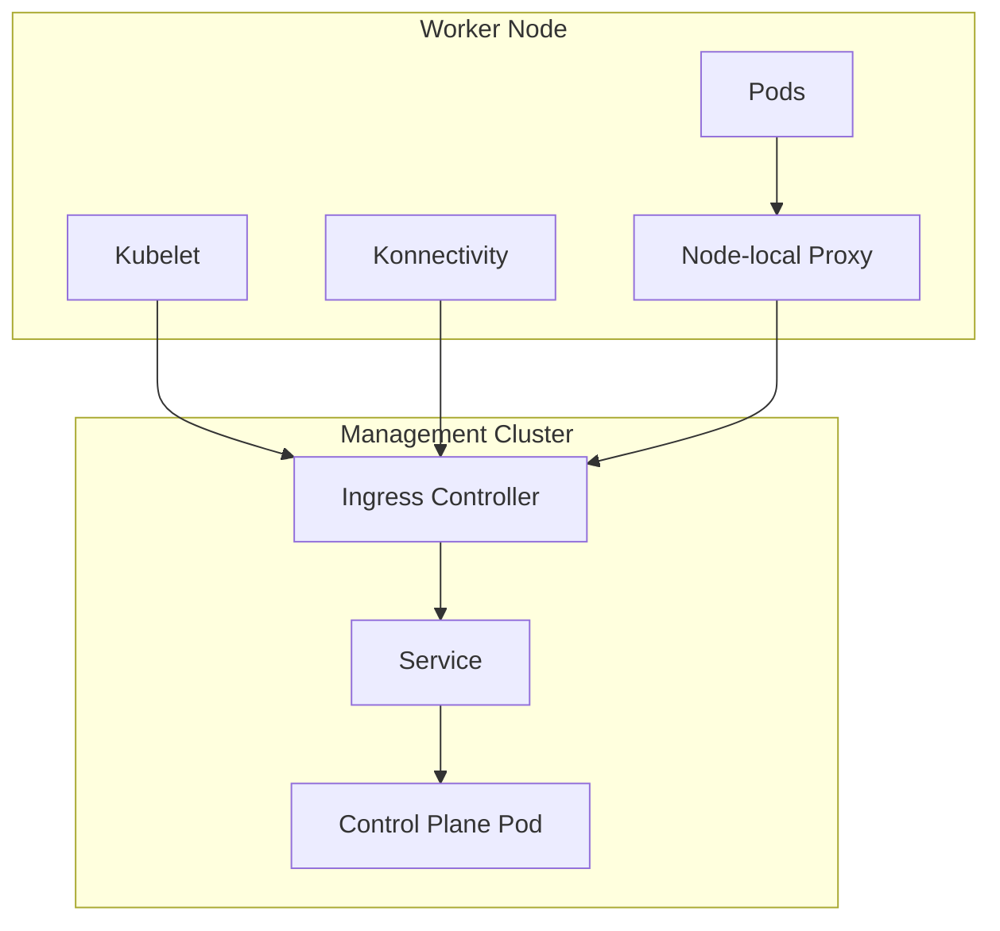

# Ingress Support for Hosted Control Planes

k0smotron now supports exposing kube-apiserver and konnectivity server through ingress controllers for HCPs, enabling access to your clusters via hostnames instead of direct service endpoints. This feature works with both standalone k0smotron clusters and Cluster API managed clusters.

!!! warning "Important Note"
    This feature requires an ingress controller that supports SSL passthrough (e.g., HAProxy, NGINX, Traefik). Ensure your ingress controller is properly configured to handle TLS traffic.

## Overview

k0smotron will create an ingress resource that routes traffic to the control plane service. Each worker node runs a
node-local proxy (Traefik) that proxies traffic from pods to the ingress controller. The kubelet connects directly to
the ingress controller for control plane communication, while pods communicate through the node-local proxy.

The proxy is deployed into the workload cluster as a `hostNetwork` DaemonSet, so no manual setup on the worker nodes is
required. Its TLS material is delivered as a Secret in the workload cluster, not written onto the node filesystem.

### Supported k0s versions

- v1.34.1+k0s.0 and later

### Supported node platforms

- Linux worker nodes: proxied by the `k0smotron-proxy` DaemonSet
- Windows worker nodes: proxied by the `k0smotron-proxy-win` DaemonSet, which runs as a
  [HostProcess](https://kubernetes.io/docs/tasks/configure-pod-container/create-hostprocess-pod/) pod

Both DaemonSets share the `app: k0smotron-proxy` label, so the `kubernetes` Service selects the proxy on every node
regardless of its OS.

## Architecture

The ingress support works by:

1. **Ingress Resource Creation**: k0smotron creates a Kubernetes Ingress resource that routes traffic to the control plane service
2. **Node-local Proxy**: A Traefik DaemonSet runs on each worker node to proxy traffic from pods to the ingress controller
3. **Service Configuration**: The kubernetes default service is configured to point to the node-local proxy for pod-to-API communication
4. **Direct Kubelet Access**: Kubelet connects directly to the ingress controller for control plane communication
5. **SSL Passthrough**: The ingress controller uses SSL passthrough to maintain end-to-end encryption

The node-local proxy terminates the pod-facing TLS connection with a server certificate signed by the cluster CA, then
re-encrypts to the ingress host with SNI and CA verification. Because it is a TCP terminate-and-reencrypt pipe, the
client-facing side pins ALPN to `http/1.1` to match the backend leg.


```mermaid
graph TB
    subgraph "Worker Node"
        Proxy[Node-local Proxy]
        Kubelet[Kubelet]
        Konnectivity[Konnectivity]
        Pods[Pods]
    end

    subgraph "Management Cluster"
        IC[Ingress Controller]
        CP[Control Plane Pod]
        SVC[Service]
    end

    Kubelet --> IC
    Konnectivity --> IC
    IC --> SVC
    SVC --> CP
    Pods --> Proxy
    Proxy --> IC
```

## Usage Examples

### Cluster API Integration

```yaml
apiVersion: controlplane.cluster.x-k8s.io/v1beta2
kind: K0smotronControlPlane
metadata:
  name: my-cluster-cp
  namespace: default
spec:
  version: v1.34.0-k0s.0
  ingress:
    apiHost: kube-api.example.com
    konnectivityHost: konnectivity.example.com
    className: haproxy
    annotations:
      haproxy.org/ssl-passthrough: "true"
```

### Standalone k0smotron Cluster

```yaml
apiVersion: k0smotron.io/v1beta2
kind: Cluster
metadata:
  name: my-cluster
  namespace: default
spec:
  version: v1.34.0-k0s.0
  ingress:
    apiHost: kube-api.example.com
    konnectivityHost: konnectivity.example.com
    className: haproxy
    annotations:
      haproxy.org/ssl-passthrough: "true"
```

## Limitations

- Requires an ingress controller that supports SSL passthrough
- Additional network latency due to the proxy layer
- The node-local proxy consumes additional resources on worker nodes
- DNS configuration is required for proper functionality
