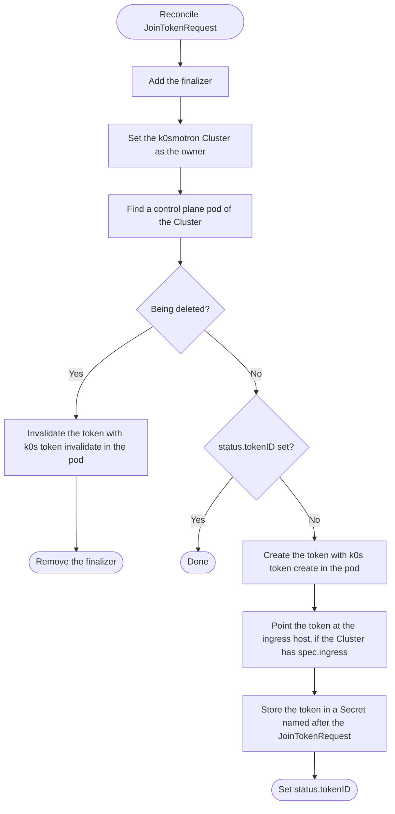

# JoinTokenRequest reconciliation workflow

```mermaid
flowchart TD
    start(["Reconcile JoinTokenRequest"]) --> finalizer["Add the finalizer"]
    finalizer --> owner["Set the k0smotron Cluster as the owner"]
    owner --> pod["Find a control plane pod of the Cluster"]
    pod --> deleting{"Being deleted?"}
    deleting -- Yes --> invalidate["Invalidate the token with k0s token invalidate in the pod"]
    invalidate --> removeFinalizer(["Remove the finalizer"])
    deleting -- No --> created{"status.tokenID set?"}
    created -- Yes --> done(["Done"])
    created -- No --> create["Create the token with k0s token create in the pod"]
    create --> ingress["Point the token at the ingress host, if the Cluster has spec.ingress"]
    ingress --> secret["Store the token in a Secret named after the JoinTokenRequest"]
    secret --> tokenID(["Set status.tokenID"])
```
