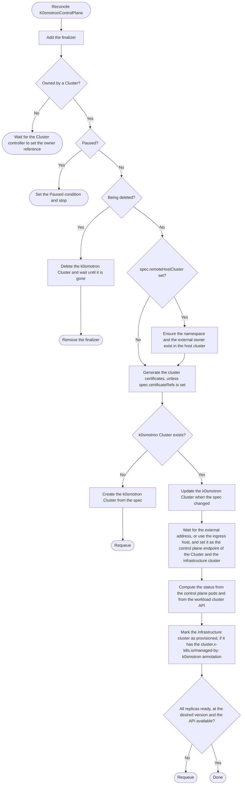

# K0smotronControlPlane reconciliation workflow

```mermaid
flowchart TD
    start(["Reconcile K0smotronControlPlane"]) --> finalizer["Add the finalizer"]
    finalizer --> owner{"Owned by a Cluster?"}
    owner -- No --> waitOwner(["Wait for the Cluster controller to set the owner reference"])
    owner -- Yes --> paused{"Paused?"}
    paused -- Yes --> stopPaused(["Set the Paused condition and stop"])
    paused -- No --> deleting{"Being deleted?"}
    deleting -- Yes --> deleteKmc["Delete the k0smotron Cluster and wait until it is gone"]
    deleteKmc --> removeFinalizer(["Remove the finalizer"])
    deleting -- No --> remote{"spec.remoteHostCluster set?"}
    remote -- Yes --> externalOwner["Ensure the namespace and the external owner exist in the host cluster"]
    remote -- No --> certs
    externalOwner --> certs["Generate the cluster certificates, unless spec.certificateRefs is set"]
    certs --> kmcExists{"k0smotron Cluster exists?"}
    kmcExists -- No --> createKmc["Create the k0smotron Cluster from the spec"]
    createKmc --> requeueCreated(["Requeue"])
    kmcExists -- Yes --> syncKmc["Update the k0smotron Cluster when the spec changed"]
    syncKmc --> endpoint["Wait for the external address, or use the ingress host, and set it as the control plane endpoint of the Cluster and the infrastructure cluster"]
    endpoint --> status["Compute the status from the control plane pods and from the workload cluster API"]
    status --> infra["Mark the infrastructure cluster as provisioned, if it has the cluster.x-k8s.io/managed-by: k0smotron annotation"]
    infra --> settled{"All replicas ready, at the desired version and the API available?"}
    settled -- No --> requeueStatus(["Requeue"])
    settled -- Yes --> done(["Done"])
```
