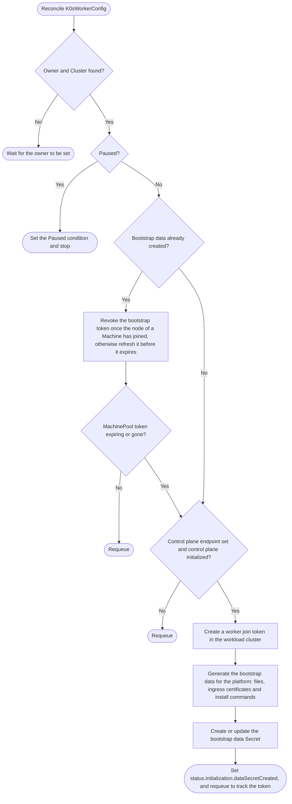

# K0sWorkerConfig reconciliation workflow

```mermaid
flowchart TD
    start(["Reconcile K0sWorkerConfig"]) --> owner{"Owner and Cluster found?"}
    owner -- No --> waitOwner(["Wait for the owner to be set"])
    owner -- Yes --> paused{"Paused?"}
    paused -- Yes --> stopPaused(["Set the Paused condition and stop"])
    paused -- No --> created{"Bootstrap data already created?"}
    created -- Yes --> token["Revoke the bootstrap token once the node of a Machine has joined, otherwise refresh it before it expires"]
    token --> rotate{"MachinePool token expiring or gone?"}
    rotate -- No --> requeueToken(["Requeue"])
    rotate -- Yes --> cpReady
    created -- No --> cpReady{"Control plane endpoint set and control plane initialized?"}
    cpReady -- No --> requeueCp(["Requeue"])
    cpReady -- Yes --> joinToken["Create a worker join token in the workload cluster"]
    joinToken --> data["Generate the bootstrap data for the platform: files, ingress certificates and install commands"]
    data --> secret["Create or update the bootstrap data Secret"]
    secret --> dataCreated(["Set status.initialization.dataSecretCreated, and requeue to track the token"])
```
