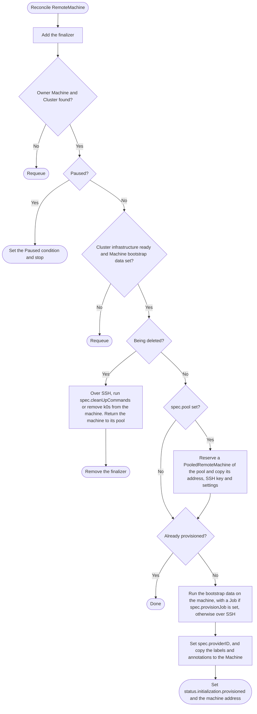

# RemoteMachine reconciliation workflow

```mermaid
flowchart TD
    start(["Reconcile RemoteMachine"]) --> finalizer["Add the finalizer"]
    finalizer --> owner{"Owner Machine and Cluster found?"}
    owner -- No --> requeueOwner(["Requeue"])
    owner -- Yes --> paused{"Paused?"}
    paused -- Yes --> stopPaused(["Set the Paused condition and stop"])
    paused -- No --> ready{"Cluster infrastructure ready and Machine bootstrap data set?"}
    ready -- No --> requeueReady(["Requeue"])
    ready -- Yes --> deleting{"Being deleted?"}
    deleting -- Yes --> cleanup["Over SSH, run spec.cleanUpCommands or remove k0s from the machine. Return the machine to its pool"]
    cleanup --> removeFinalizer(["Remove the finalizer"])
    deleting -- No --> pool{"spec.pool set?"}
    pool -- Yes --> reserve["Reserve a PooledRemoteMachine of the pool and copy its address, SSH key and settings"]
    pool -- No --> provisioned
    reserve --> provisioned{"Already provisioned?"}
    provisioned -- Yes --> done(["Done"])
    provisioned -- No --> bootstrap["Run the bootstrap data on the machine, with a Job if spec.provisionJob is set, otherwise over SSH"]
    bootstrap --> providerID["Set spec.providerID, and copy the labels and annotations to the Machine"]
    providerID --> provisionedStatus(["Set status.initialization.provisioned and the machine address"])
```
